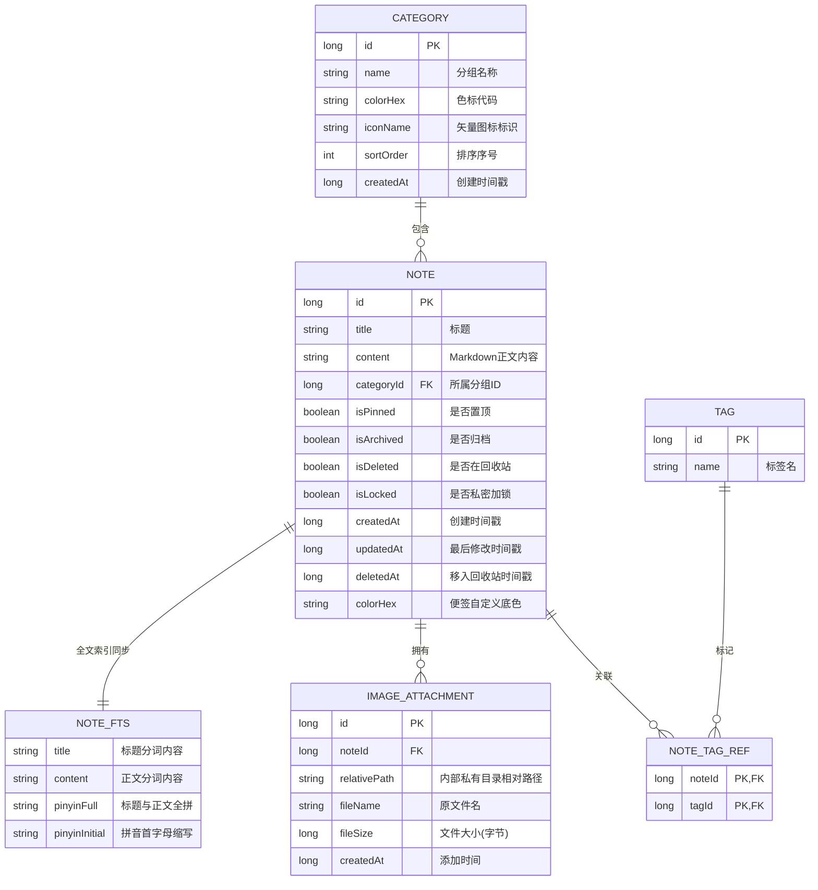

# 《超级备忘录 (Super Memo)》 Android 16 详细设计文档

---

## 1. 项目概述与设计目标

### 1.1 项目背景
本应用是一款专为 **Android 16**（API Level 36, Baklava）深度定制的现代化、高性能、注重隐私与离线体验的“超级备忘录”应用。应用遵循 Google 推荐的最新 Android 架构规范，采用纯原生 **Kotlin + Jetpack Compose + Material 3** 技术栈，实现极简优雅的视觉交互与强悍的多维检索管理能力。

### 1.2 核心目标与特性
1. **全面适配 Android 16**：全屏 Edge-to-Edge 边到边沉浸式布局、预测性返回手势（Predictive Back）、Material You 动态色彩（Monet Engine）、支持 16 KB 内存页面对齐。
2. **结构化正文与 Markdown 混合排版**：支持分级标题、粗体/斜体、待办 Checklist 清单勾选、代码块、插入本地高清图片附件与全屏预览。
3. **超强模糊搜索体系**：基于 SQLite FTS5 全文索引 + 中文汉字拼音全拼及首字母模糊匹配 + 搜索词高亮呈现 + 多维过滤组合。
4. **灵活的分组与多维分类管理**：支持自定义分组（文件夹）、颜色色标、矢量图标、重命名、标签系统（多标签支持）、便签置顶、归档与 30 天回收站防误删。
5. **全能导入与导出**：单篇导出为 Markdown/纯文本/长图分享；批量全量导出/恢复为 ZIP 压缩包（包含图片资源）与标准 JSON 快照；支持外部 .md/.txt 文件直接导入。
6. **隐私保险箱与绝对离线**：系统级生物识别（指纹/人脸/PIN）私密锁定；应用零网络权限声明（Zero Network Permission），无埋点无云端泄露隐患，数据 100% 留存在用户设备本地。
7. **高效交互**：支持长按批量选择（批量移动分组、批量加标签、批量删除/归档）、Glance 桌面微件（Desktop Widget）。

---

## 2. 系统技术架构

### 2.1 技术选型
| 分层 / 模块 | 技术方案 | 选型考量 |
| :--- | :--- | :--- |
| **开发语言** | Kotlin 2.1+ | 现代化协程、Flow 响应式流支持、空安全 |
| **UI 框架** | Jetpack Compose + Material 3 | 声明式 UI，原生支持 Android 16 动态主题和流畅动画 |
| **架构模式** | Clean Architecture + MVI/MVVM | 单向数据流 (UDF)，职责解耦，易于单元测试与拓展 |
| **持久层数据库** | Jetpack Room 2.7+ (SQLite FTS5) | 官方推荐 ORM，原生集成全文检索虚拟表，支持响应式查询 |
| **异步处理** | Kotlin Coroutines + StateFlow / SharedFlow | 非阻塞异步 I/O，平滑处理全文索引分词与文件压缩解压 |
| **图片加载与处理** | Coil 3.x (Compose 纯 Kotlin 引擎) | 轻量、快速缓存、支持系统 PhotoPicker 图片解码与持久化 |
| **桌面小部件** | Android Jetpack Glance (Compose 风格) | 使用统一的 Compose 语义编写 Android 16 桌面小部件 |
| **生物识别** | AndroidX Biometric | 硬件级加密与指纹/面部统一认证标准接口 |

### 2.2 整体分层架构图

```
+-------------------------------------------------------------+
|                     Presentation Layer                      |
|  - Jetpack Compose UI (HomeScreen, EditScreen, SearchScreen)|
|  - Material 3 Theme (Dynamic Colors, Typography, Shapes)    |
|  - Glance AppWidget (Desktop Quick Note & List)             |
|  - ViewModels (UDF StateFlow & UI Intent Actions)           |
+-------------------------------------------------------------+
                              | (StateFlow / Actions)
+-------------------------------------------------------------+
|                         Domain Layer                        |
|  - Use Cases (SearchNotesUseCase, ImportZipUseCase, etc.)   |
|  - Domain Models (Note, Category, Tag, SearchFilter)        |
|  - PinyinSearchEngine (汉字拼音转换与分词模糊匹配算法)        |
+-------------------------------------------------------------+
                              |
+-------------------------------------------------------------+
|                          Data Layer                         |
|  - NoteRepository / CategoryRepository / BackupRepository   |
|  - Room Database (Notes, Categories, Tags, FTS5 Virtual)    |
|  - Local File Storage Manager (Internal Images & ZIP I/O)   |
|  - Security & Biometric Manager                             |
+-------------------------------------------------------------+
```

---

## 3. 数据库与存储架构设计

### 3.1 实体关系图 (ER Diagram)



### 3.2 数据表结构定义 (Room DDL)

1. **notes (主表)**:
   - `id`: INTEGER PRIMARY KEY AUTOINCREMENT
   - `title`: TEXT NOT NULL DEFAULT ''
   - `content`: TEXT NOT NULL DEFAULT ''
   - `category_id`: INTEGER REFERENCES categories(id) ON DELETE SET NULL
   - `is_pinned`: INTEGER NOT NULL DEFAULT 0
   - `is_archived`: INTEGER NOT NULL DEFAULT 0
   - `is_deleted`: INTEGER NOT NULL DEFAULT 0
   - `is_locked`: INTEGER NOT NULL DEFAULT 0
   - `created_at`: INTEGER NOT NULL
   - `updated_at`: INTEGER NOT NULL
   - `deleted_at`: INTEGER DEFAULT NULL
   - `color_hex`: TEXT DEFAULT NULL

2. **categories (分组表)**:
   - `id`: INTEGER PRIMARY KEY AUTOINCREMENT
   - `name`: TEXT NOT NULL UNIQUE
   - `color_hex`: TEXT NOT NULL DEFAULT '#6750A4'
   - `icon_name`: TEXT NOT NULL DEFAULT 'folder'
   - `sort_order`: INTEGER NOT NULL DEFAULT 0
   - `created_at`: INTEGER NOT NULL

3. **tags (标签表)**:
   - `id`: INTEGER PRIMARY KEY AUTOINCREMENT
   - `name`: TEXT NOT NULL UNIQUE

4. **note_tag_refs (笔记标签关联表)**:
   - `note_id`: INTEGER NOT NULL
   - `tag_id`: INTEGER NOT NULL
   - PRIMARY KEY (`note_id`, `tag_id`)

5. **image_attachments (图片附件表)**:
   - `id`: INTEGER PRIMARY KEY AUTOINCREMENT
   - `note_id`: INTEGER NOT NULL REFERENCES notes(id) ON DELETE CASCADE
   - `relative_path`: TEXT NOT NULL
   - `file_name`: TEXT NOT NULL
   - `file_size`: INTEGER NOT NULL
   - `created_at`: INTEGER NOT NULL

6. **notes_fts (FTS5 全文检索引擎虚拟表)**:
   - 使用 SQLite 虚拟表技术：`CREATE VIRTUAL TABLE notes_fts USING fts5(title, content, pinyin_full, pinyin_initial, content='notes', content_rowid='id');`
   - 通过 Room Database Trigger 或 Repository 保存时自动维护索引一致性。

---

## 4. 核心功能深入设计

### 4.1 强大搜索与拼音模糊检索模块 (Super Search Engine)
搜索是超级备忘录的核心亮点，设计为**三级复合检索**机制：

1. **拼音提取算法 (Pinyin Engine)**:
   - 内置轻量高效的中文转拼音映射字典（覆盖全部常用汉字与多音字首选），无需引入庞大第三方依赖。
   - 保存/更新备忘录时，后台自动异步提取并生成：
     - `pinyin_full`: 汉字全拼字符串，例如“项目会议” -> `xiangmuhuiyi`
     - `pinyin_initial`: 拼音首字母字符串，例如“项目会议” -> `xmhy`
2. **多维模糊查询组合**:
   - 用户输入关键词如 `xmh`，系统构建查询条件：
     - 精确包含匹配：`title LIKE '%xmh%' OR content LIKE '%xmh%'`
     - 拼音首字母前缀/包含匹配：`pinyin_initial LIKE '%xmh%'`
     - 全拼模糊匹配：`pinyin_full LIKE '%xmh%'`
     - FTS5 全文索引前缀检索：`notes_fts MATCH 'xmh*'`
3. **搜索结果高亮与摘录生成 (Snippet & Highlighting)**:
   - 在列表页动态提取包含关键词的上下文片段（前后约 30 字），并将命中的文字用 Material 3 主题主色进行富文本高亮 (`AnnotatedString`)。
4. **多维度条件组合过滤**:
   - 分组筛选：支持选择“全部”或指定分组。
   - 属性标签：全部、包含待办 Checklist、包含图片附件、已加锁。
   - 时间跨度筛选：今天、本周（7天内）、本月（30天内）、历史更早。
   - 排序策略：按最后修改时间（最新/最旧）、按创建时间、按标题字母升序。

### 4.2 编辑器与 Markdown 交互设计
1. **轻量即时富文本渲染**:
   - 输入框支持 Markdown 快捷标记输入。
   - 快捷格式化工具栏（位于软键盘顶部）：
     - `H1` / `H2` / `H3` 标题快速切换
     - `B` 粗体 (`**text**`)、`I` 斜体 (`*text*`)、`S` 删除线 (`~~text~~`)
     - `[ ]` 待办清单项：点击插入 `- [ ] `，在阅读/预览模式下可直接点击打勾变为 `- [x] `
     - `List` 有序与无序列表快速缩进
     - `Quote` 引用块 (`> `)
     - `Image` 从相册选取或拍照插入图片
     - `Undo` 撤销 / `Redo` 重做支持
2. **待办清单互动 (Checklist Integration)**:
   - 自动识别正文中的 `- [ ] ` 和 `- [x] `。
   - 在卡片预览和详情页面显示“待办进度条”（如：已完成 3/5）。
   - 支持在备忘录详情查看模式下一键点击勾选框，实时更新数据库正文，体验极佳。
3. **安全图片存储规范**:
   - 通过系统 `ActivityResultContracts.PickVisualMedia` 选择图片。
   - 应用将图片流安全拷贝至内部存储 `files/attachments/` 目录下，分配 UUID 文件名，避免原图被系统图库删除后失效。

### 4.3 分组管理与组织层级 (Taxonomy)
1. **分组 (Categories)**:
   - 每个备忘录归属于一个主分组（默认“默认备忘”）。
   - 用户可随时添加新分组、重命名、选择专属色彩代码（从 12 种精心调配的 Material 调色盘选取）与图标。
   - 删除分组时提供双重选择：“仅删除分组（保留组内备忘录移至默认分组）”或“连同组内备忘录一并移至回收站”。
2. **标签系统 (Tags)**:
   - 自由创建与附加标签，一条备忘录可关联任意多个标签。
   - 首页抽屉与搜索界面提供标签聚合视图，点击标签即可过滤对应备忘录。
3. **生命周期与安全机制**:
   - **置顶 (Pin)**：固定展示在列表最上方，带有专属图钉徽标。
   - **归档 (Archive)**：不破坏数据，但从首页日常列表中隐去，在“归档箱”中集中归纳。
   - **回收站 (Recycle Bin)**：所有删除操作默认仅为软删除 (`is_deleted = true`)，支持随时还原或手动彻底粉碎；系统对超过 30 天的垃圾备忘录支持一键清理。

### 4.4 导入导出与数据备份恢复体系 (Import & Export Engine)
1. **单篇导出与即时分享**:
   - **Markdown 文件 (.md)**：标准 UTF-8 编码，包含 FrontMatter 元数据（创建时间、标签、分组）。
   - **纯文本文件 (.txt)**：去格式化纯净文本。
   - **生成优雅长图 (Share as Image)**：将备忘录标题、正文排版、图片渲染为精美卡片 Bitmap，调用系统原生分享面板发往微信、QQ 或保存至相册。
2. **批量/全量 ZIP 打包备份**:
   - 结构设计：
     ```
     SuperMemo_Backup_20260914.zip
     ├── manifest.json            # 备份元数据、版本号、分组表与标签映射
     ├── notes.json               # 完整的结构化笔记列表数据
     ├── markdown/                # 导出的独立 .md 文件集合（按分组子目录分拣）
     │   ├── 工作/
     │   │   └── 项目计划.md
     │   └── 生活/
     │       └── 购物清单.md
     └── attachments/             # 所有笔记所引用的高清图片附件资源
         ├── img_01.jpg
         └── img_02.png
     ```
3. **全量数据恢复**:
   - 用户通过系统 SAF 文件选择器选中 `.zip` 或 `.json` 文件。
   - 后台协程校验清单完整性与格式版本。
   - 智能冲突解决策略：用户可选择“合并导入（保留本地已有，追加新项）”或“全新覆盖恢复”。
4. **外部文件快速导入**:
   - 支持从文件管理器选择单个或多个 `.md` / `.txt` 文件，自动解析文件名为备忘录标题，文件内容为正文，并归入指定分组。

### 4.5 隐私保险箱与生物识别
1. **硬件级生物识别认证**:
   - 集成 `androidx.biometric.BiometricPrompt`。
   - 支持指纹识别、面容识别（Class 3 强生物识别）或锁屏设备凭证（PIN / 图案密码）。
2. **多级保护模式**:
   - **单条备忘录加锁**：普通列表仅显示“已加锁备忘录”，标题与内容模糊化/隐藏；点击后需通过指纹验证方可查看与编辑。
   - **应用启动保护**：支持开启“打开应用时校验生物识别”，防止他人翻看手机时泄露敏感记录。
3. **纯净离线原则**:
   - 无任何上传服务器行为，无第三方广告 SDK，彻底杜绝数据外泄隐患。

---

## 5. Android 16 专属特性适配规范

### 5.1 全屏 Edge-to-Edge 沉浸设计
- 在 Android 15 及 Android 16 中，系统默认强制启用边到边布局。
- 应用在 `MainActivity` 中调用 `enableEdgeToEdge()`。
- 全量适配 Compose `WindowInsets.statusBars`、`WindowInsets.navigationBars` 和 `WindowInsets.ime`（软键盘智能避让，平滑跟随软键盘弹起高度，解决输入框被遮挡问题）。

### 5.2 预测性返回手势 (Predictive Back Gesture)
- 在编辑页、搜索页、分组详情页中，原生适配 Android 16 预测性返回动画。
- 在编辑草稿未保存或正在进行重要批量操作时，拦截返回手势并触发友好的退出确认/自动保存提示。

### 5.3 Material 3 动态色彩与主题定制
- 默认支持 **Material You Monet** 引擎，界面主色调、辅助色根据 Android 16 用户的壁纸与系统配色实时动态衍生。
- 提供独立的手动主题切换开关：
  - 跟随系统
  - 明亮模式 (Light Theme)
  - 深色模式 (Dark Theme)
  - 纯黑模式 (AMOLED Pure Black，专为 OLED 屏幕极致省电优化)

### 5.4 Glance 桌面小部件 (Desktop Widget)
- 适配 Android 16 主屏幕小部件规范。
- 尺寸自适应（从 2x2 到 4x4 网格）。
- 小部件界面：顶部展示应用名与快速添加按钮（点击直接拉起新建备忘录界面），下方滚动展示置顶及最近更新的 5 条备忘录，点击条目直达笔记详情。

---

## 6. UI 界面与交互流设计 (UI/UX Specification)

### 6.1 页面流转架构图

```
+-----------------------------------------------------------------------------+
|                                HomeScreen                                   |
| - 顶部栏: 侧滑分组抽屉按钮 / 搜索入口栏 / 视图切换(单列/网格) / 批量管理入口    |
| - 过滤 Chips: 全部 / 置顶 / 待办清单 / 含图片                                  |
| - 主列表: 瀑布流双列或单列卡片（展示标题、摘要高亮、分类标签、待办进度、图片微缩）|
| - 悬浮按钮 (FAB): 新建备忘录 (带动画展开)                                      |
+-----------------------------------------------------------------------------+
       |                           |                            |
       v (点击搜索)                 v (点击便签/新建)             v (展开侧栏)
+-------------------+      +----------------------+      +--------------------+
|   SearchScreen    |      |    EditNoteScreen    |      |  NavigationDrawer  |
| - 实时拼音/词输入框|      | - 标题输入框         |      | - 全部分组导航      |
| - 历史搜索词 Chips |      | - Markdown格式工具栏 |      | - 新建/管理分组入口 |
| - 多维高级筛选抽屉 |      | - 正文编辑与实时预览 |      | - 标签云筛选       |
| - 命中文本高亮展示 |      | - 本地图片插入与预览 |      | - 归档箱 / 回收站   |
+-------------------+      | - 分类/标签绑定与锁  |      | - 数据备份与设置    |
                           +----------------------+      +--------------------+
                                      |
                           +----------------------+
                           | BackupRestoreScreen  |
                           | - 导出 ZIP / JSON    |
                           | - 导入恢复 / 冲突合并|
                           +----------------------+
```

### 6.2 关键屏幕交互细节

1. **主列表页 (HomeScreen)**:
   - 卡片呈现：针对含有 Checklist 的笔记，直接在卡片上显示待办复选框和进度条；针对含有图片的笔记，优雅展示圆角封面预览。
   - 交互动效：列表滑动平滑无掉帧；长按任意卡片震动反馈并进入多选模式，顶部转换为批量操作栏（已选数量、全选、移动至分组、标记归档、删除）。
2. **编辑与阅读页 (EditNoteScreen)**:
   - 标题正文平滑切换。
   - 底部常驻悬浮工具条：在软键盘弹起时吸附于软键盘正上方，提供一键加粗、列表、标题、插图、待办复选框快捷插入。
   - 自动保存：每隔 1 秒无操作或界面离开、应用退至后台时，自动异步写回数据库，杜绝任何意外关机或崩溃导致的内容丢失。
3. **搜索页 (SearchScreen)**:
   - 自动聚焦软键盘。
   - 输入“xmh”立刻在 20ms 内通过 FTS5 与拼音字典模糊匹配出“项目汇报”、“下午项目会议”等记录，命中的文字片段以加粗高亮底色展示。

---

## 7. 安全、测试与交付标准

1. **零权限策略**：
   - 不声明 `android.permission.INTERNET`，从系统底层彻底阻断任何网络访问可能性。
   - 读取媒体仅使用 Android 13+ Photo Picker (`PickVisualMedia`)，无需向用户索取广泛的外部存储读写大权限。
2. **数据完整性保障**：
   - 数据库事务封装 (`@Transaction`)，确保批量操作与导入导出时的原子性。
   - 回收站 30 天自动清理机制，保障存储空间健康。
3. **工程化与编译要求**：
   - Target SDK: 36 (Android 16)
   - Compile SDK: 36
   - Min SDK: 26 (覆盖 95% 以上现代 Android 机型)
   - 严谨的代码结构与单元测试覆盖（包括汉字拼音引擎单测、FTS5 检索测试、ZIP 导入导出解包测试）。
